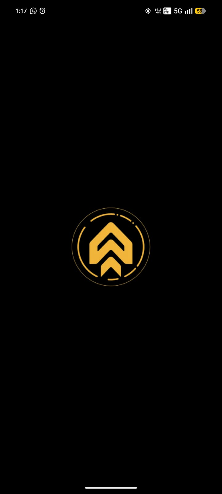
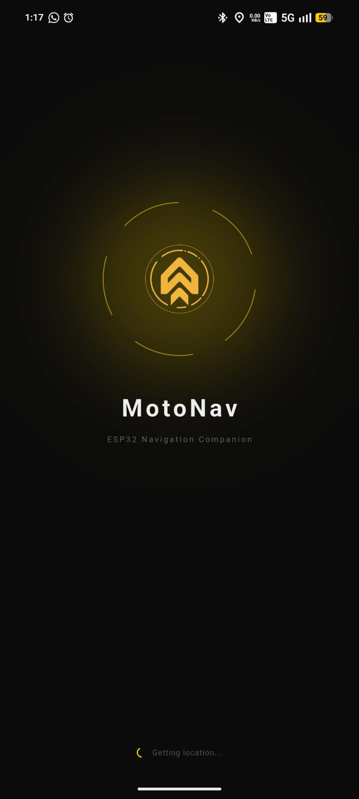
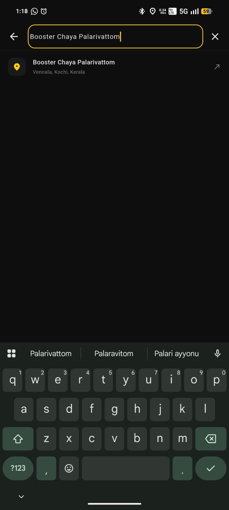
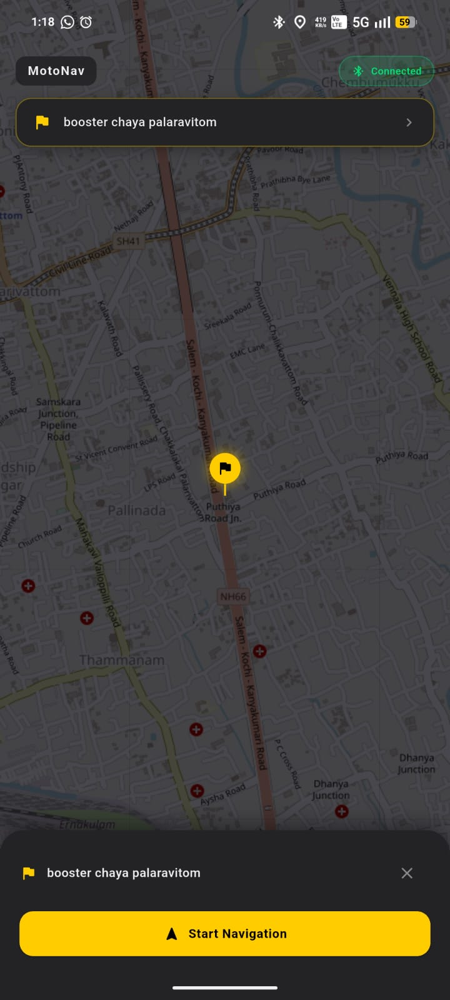
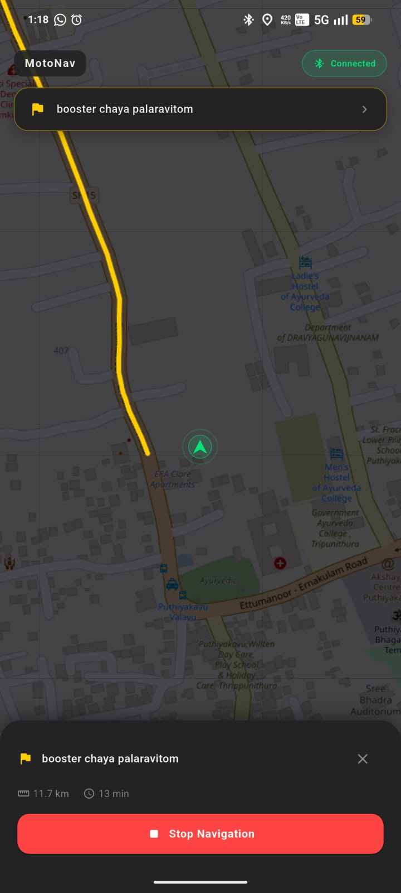
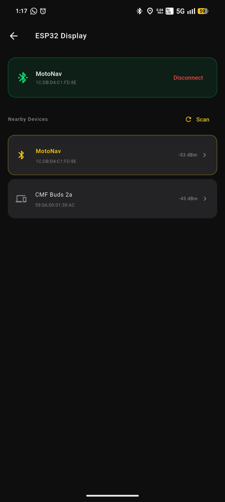
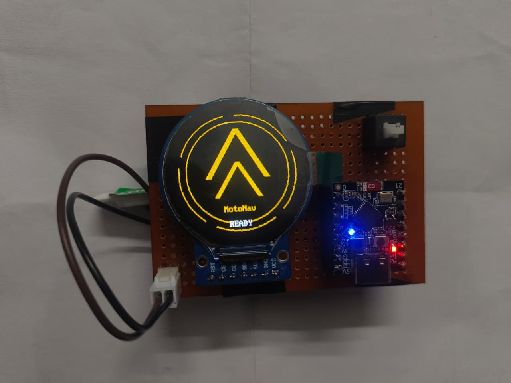
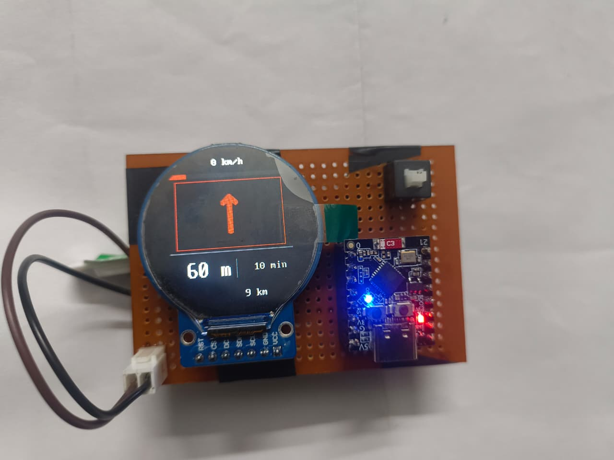

# MotoNav

A motorcycle navigation companion app for Android that sends turn-by-turn instructions to an ESP32-C3 microcontroller with a GC9A01 240×240 circular display over BLE.

The phone handles all the heavy work — GPS, routing, search — and sends compact 11-byte packets to the display. No maps rendered on device, vector data only.

---

## Screenshots

### App

<table>
  <tr>
    <td align="center"><br/><sub>Splash Screen</sub></td>
    <td align="center"><br/><sub>Loading</sub></td>
    <td align="center"><br/><sub>Search</sub></td>
  </tr>
  <tr>
    <td align="center"><br/><sub>Destination</sub></td>
    <td align="center"><br/><sub>Navigation Route</sub></td>
    <td align="center"><br/><sub>BLE Connection</sub></td>
  </tr>
</table>

### ESP32 GC9A01 Display

<table>
  <tr>
    <td align="center"><br/><sub>Boot Screen</sub></td>
    <td align="center"><br/><sub>Turn-by-Turn View</sub></td>
  </tr>
</table>

**Boot animation:**

<video src="motonav_assets/v1/esp32_loading_vid.mp4" controls width="320"></video>

---

## Hardware

| Component | Detail |
|---|---|
| MCU | ESP32-C3 Super Mini |
| Display | GC9A01 — 240×240 circular TFT |
| Communication | BLE (flutter_blue_plus) |
| Optional MCU | Raspberry Pi Pico 2 W |

---

## Features

- Turn-by-turn navigation with maneuver arrows (bitmap rendered)
- Live countdown bar to next turn — green → yellow → red
- Distance to next turn + total remaining distance
- Current speed display
- Heading-up map rotation during navigation — direction of travel always points to the top of the screen
- Compass cone on the user marker — visual indicator of phone orientation, independent of map rotation
- BLE auto-reconnect to named device
- Place search powered by Nominatim (OSM, no API key)
- Routing via OSRM (free, no API key required)
- Offline map area download with tile caching (FMTC)
- Partial screen redraw — only changed regions update, no flicker

---

## Tech Stack

| Layer | Choice |
|---|---|
| Framework | Flutter (Android) |
| State | Riverpod (StateNotifier) |
| Map | flutter_map + OSM tiles |
| Routing | OSRM (free, no key) |
| Offline Maps | flutter_map_tile_caching (FMTC) |
| Search | Nominatim (OSM, no key) |
| GPS | geolocator |
| Compass | flutter_compass |
| BLE | flutter_blue_plus |
| MCU firmware | MicroPython |

---

## Project Structure

```
lib/                        Flutter app
  core/                     Config, constants, services, theme
  features/
    map/                    Map screen, search, GPS
    navigation/             Routing, step tracking, BLE packet sender
    ble/                    BLE scan, connect, auto-reconnect
    offline_maps/           Area download screen

esp32/
  main.py                   ESP32-C3 firmware (Tripper-style UI)
  main(pico).py             Pico 2 W firmware

arrows/
  convert.py                PNG → RGB565 .bin converter
  *.png                     Source arrow icons (Google Material)

fonts/
  vga1_16x32.py             Large bitmap font (turn distance)
  vga1_8x16.py              Small bitmap font (speed, remaining)
```

---

## Setup

### Flutter App

```bash
flutter pub get
flutter run
```

No API keys required. OSRM routing uses the public demo server.

### ESP32 Firmware

1. Flash MicroPython to your ESP32-C3
2. Generate arrow bitmaps:
   ```bash
   pip install pillow
   cd arrows
   python convert.py
   ```
3. Copy to device filesystem:
   ```
   /arrows/large_sign_*.bin    (8 files, generated above)
   /arrows/small_sign_*.bin    (8 files, generated above)
   /fonts/vga1_16x32.py
   /fonts/vga1_8x16.py
   main.py  (copy from esp32/main.py)
   ```

### Wiring (ESP32-C3 Super Mini)

| Display Pin | ESP32 Pin |
|---|---|
| SCK | GPIO 4 |
| MOSI | GPIO 6 |
| DC | GPIO 2 |
| CS | GPIO 7 |
| RST | GPIO 3 |

### Wiring (Pico 2 W)

| Display Pin | Pico Pin |
|---|---|
| SCK | GP10 |
| MOSI | GP11 |
| DC | GP8 |
| CS | GP9 |
| RST | GP12 |
| BL | GP13 |

---

## BLE Packet Format

11 bytes, header `TN` (0x54 0x4E):

```
[0]     'T'
[1]     'N'
[2]     current turn sign + 10  (uint8)
[3..4]  distance to turn  (uint16 BE, x10 m units)
[5..6]  remaining distance (uint16 BE, km units)
[7]     next turn sign + 10  (uint8)
[8]     speed km/h  (uint8)
[9..10] ETA minutes  (uint16 BE)
```

Sign values: `-4` U-turn · `-3` sharp left · `-2` left · `-1` slight left · `0` straight · `1` slight right · `2` right · `3` sharp right · `4` arrive · `6` roundabout

---

## License

MIT
